*阅读摘要*
* 程序(Program)，进程(Process)，线程(Thread)的区别。
* Java线程的基本概念（调度，优先级，分类，生命周期）。
* Java线程的创建和使用。
* 线程安全和多线程的同步，死锁。
* 线程简单通讯。
<!-- more -->

操作系统这门课学的内容已经让我都还给老师了。Orz！

## 程序，进程，线程的概念
这里就不多做赘述了，直接引入操作系统课程中的相关概念。

程序
>程序(program)是为完成特定任务、用某种语言编写的一组指令的集合。包含有指令和数据的文件，被存储在磁盘或其他数据存储设备中。

进程
>进程(process)是程序的一次执行过程。进程是进程实体的一次执行过程（动态性），有一定的生命周期：由创建而产生，由调度而执行，由撤消而消亡。

线程
>线程（thread）是操作系统能够进行运算调度的最小单位。它被包含在进程之中，是进程中的实际运作单位。一条线程指的是进程中一个单一顺序的控制流，一个进程中可以并发多个线程，每条线程并行执行不同的任务。

::: tip
区别，程序是静态概念，进程是动态概念，进程是资源分配的最小单位，程作为调度和执行的单位，每个线程拥有独立的运行栈和程序计数器。（Java）
:::

## Java线程的创建和使用  

### 1. 继承`Thread`类 JDK1.0

1. 定义一个子类并继承Thread类。
2. 在子类中重写Thread类的run()方法。
3. 创建子类对象（创建线程对象）。
4. 通过线程对象调用start()方法启动当前线程。  
   
:::tip
1. 线程需要执行的任务写在run()方法内，启动线程必须使用start()方法启动，如果直接调用run()方法等同于调用普通方法，实际还是在main线程中执行。
2. 如果一个线程已经通过start()方法启动，再次调用start方法会抛`IllegalThreadStateException`
3. 线程run()方法由JVM调用，何时调用，执行过程调度由操作系统进行调度。
:::


**代码示例**
```java
package junzhou;

/**
 * 判断number是否为偶数
 */
class MultiThread extends Thread {
    private int number = 0;

    MultiThread(int number) {
        this.number = number;
    }

    @Override
    public void run() {
        if (number % 2 == 0) {
            System.out.println(getName() + ": " + number + " is even number");
        } else {
            System.out.println(getName() + ": " + number + " is odd number");
        }
    }
}

public class Main {
    
    public static void main(String[] args) {
        // write your code here
        MultiThread thread1 = new MultiThread(20);
        MultiThread thread2 = new MultiThread(19);//创建线程
        thread1.start();//启动线程
        thread2.start();
    }
}

```

### 2. 实现`Runnable`接口 JDK1.0  

1. 定义Runnable接口的实现类。
2. 实现类中重写Runnable接口的run()方法。
3. 通过Thread类有参构造器创建线程对象。
4. 调用Thread类的start方法启动线程，调用Runnable接口实现类的run()方法。

:::tip
这里无法通过Runnable接口实现类对象调用start方法，大致过程是将Runnable接口的实现类对象作为实参传递给Thread类的构造器，然后由Thread类对象的start方法启动，调用Runnable对象的run方法。具体的调用过程可以查看Thread类的代码。
:::

**代码示例**

```java
package junzhou;

/**
 * 判断number是否为偶数
 */
class MultiThreadRunnable implements Runnable {

    private int number = 0;

    MultiThreadRunnable(int number) {
        this.number = number;
    }

    @Override
    public void run() {
        if (number % 2 == 0) {
            System.out.println(Thread.currentThread().getName() + ": " + number + " is even number");
        } else {
            System.out.println(Thread.currentThread().getName() + ": " + number + " is odd number");
        }
    }
}

public class Main {

    public static void main(String[] args) {
        // write your code here

        MultiThreadRunnable thread1 = new MultiThreadRunnable(17);
        MultiThreadRunnable thread2 = new MultiThreadRunnable(10);
        new Thread(thread1,"线程1").start();
        new Thread(thread2).start();
    }
}

```

:::tip
继承Thread和实现Runnable接口两种方法的异同  
* 线程代码均在二者实现类的run()方法中。
* Java是单继承机制，实现Runnable接口避免了单继承的局限性。多个线程可以共享同一个接口实现类对象。
:::

### 3. Thread类的常见方法

**Constructor**
* `public Thread()`
* `public Thread(ThreadGroup group,String name)`
* `public Thread(Runnable target)`
* `public Thread(Runnable target,String name)`
* `public Thread(ThreadGroup group,Runnable target,String name)`

:::tip
`name`线程名称，线程命名需要在线程启动前进行。
`ThreadGroup`是Java提供的一种对线程进行分组管理的手段，这里不展开描述了，有兴趣的可以自行查阅Java doc。
`Runnable target` 通过继承Runnable接口实现多线程时，通过target调用重写的接口类run()方法，如果target省略，则调用此线程的run()方法。
:::

**Method**
* `public void start()`
启动线程
* `public static Thread currentThread()`
返回当前执行线程对象。在Thread类中就是this，通常在main线程和Runnable接口实现类中使用。
* `public final String getName()`
获取线程名称
* `public final String setName()`
设置线程名称（应在start前进行）
* `public final int getPriority()`
获取线程优先级
* `public final int setPriority()`
设置线程优先级
* `public static void yield()`
暂停当前正在执行的线程，把执行权让给优先级相同或更高的线程
* `public final void stop()` @Deprecated
强制结束线程生命周期（不建议使用）
* `public final void join()throws InterruptedException`  
调用其他线程的join()方法，当前线程进入阻塞状态，直到被调线程执行结束。
* `public void interrupt()`
线程中断。
* `public static void sleep(long millis)throws InterruptedException`  
放弃cpu使用权，时间结束后重新进入线程执行队列排队。
* `public final boolean isAlive()`
判断线程是否活着。
* `public final void suspend()`@Deprecated
挂起当前线程。
* `public final void resume()`@Deprecated
如果线程处于活动状态但已挂起，则将继续执行该线程并允许其执行。  
* `public final void setDaemon(boolean on)`
设置为守护线程

**Field**
* `MIN_PRIORITY` 最小线程优先级 0
* `NORM_PRIORITY` 默认线程优先级 5
* `MAX_PRIORITY` 最大线程优先级 10
  
### 4. 实现`Callable`接口 JDK5.0

1. 定义一个Callable的实现类
2. 实现实现类中的call方法（线程所执行的操作写在call方法中）
3. 创建Callable实现类对象和FutureTask类对象，将其作为实参传递到FutureTask的构造器中。
4. 将FutureTask对象传递给Thread类的构造器中，调用start方法启动。
5. 通过FutureTask对象的get方法获取线程返回值。
   
:::tip
0. Callable是一个泛型接口，支持泛型和返回值，可以抛出异常。需要借助FutureTask实现类，用于接收返回值。
1. FutureTask是Future接口的唯一实现类，它同时实现了runnable接口和Futrue接口。
2. 可以对具体Runnable、Callable任务的执行结果进行取消、查询任务是否完成、获取结果等。
::: 


**代码示例**

```java
package junzhou;

import java.util.concurrent.Callable;
import java.util.concurrent.ExecutionException;
import java.util.concurrent.FutureTask;

/**
 * @author Junzhou Liu
 * @created 2020/3/29 21:02
 */


/**
 * 计算0到endNumber的所有数和
 */
class ThreadCallable implements Callable {
    private int endNumber = 0;

    ThreadCallable(int endNumber) {
        this.endNumber = endNumber;
    }

    @Override
    public Object call() {
        int sum = 0;
        for (int i = 0; i < endNumber; i++) {
            System.out.println("当前执行的是线程 " + Thread.currentThread().getName());
            sum += i;
        }
        return sum;
    }
}

public class MultiThreadCallable {
    public static void main(String[] args) {

        ThreadCallable thread1 = new ThreadCallable(20);
        ThreadCallable thread2 = new ThreadCallable(100);
        FutureTask futureTask = new FutureTask(thread1);
        FutureTask futureTask2 = new FutureTask(thread2);
        new Thread(futureTask).start();
        new Thread(futureTask2).start();
        try {
            Object res = futureTask.get();
            Object res2 = futureTask2.get();
            System.out.println(res);
            System.out.println(res2);
        } catch (InterruptedException e) {
            e.printStackTrace();
        } catch (ExecutionException e) {
            e.printStackTrace();
        }

    }
}

```

### 5. 使用线程池

:::tip
这块内容写的比较简略，如果想了解更多细节内容，请自行查阅Java doc
::: 

使用`executService` `Executor`创建线程池。

1. 创建指定线程数的线程池。
2. 定义Runnable或Callable接口实现类,将其实现类对象提交到到线程池中。
3. 关闭池。

:::tip

**使用线程池的优点**  
* 提前创建多个线程，使用时直接获取，避免频繁创建，销毁。响应速度快。
* 线程池中的线程可复用，降低资源消耗。
* 易于管理
  
:::  

**相关API**

* `void execute(Runnable command)`执行任务，没有返回值，一般执行Runnable
* `<T> Future<T> submit(Callable<T> task)`执行任务，有返回值，一般执行Callable
* `void shutdown()` 关闭池
* `Executors.newCachedThreadPool()`创建一个可根据需要创建新线程的线程池
* `Executors.newFixedThreadPool(threadNumber)` 创建一个可重用固定线程的线程池
* `Executors.newSingleThreadExecutor()`创建一个只有一个线程的线程池
* `Executors.newScheduledThreadPool(n)`创建一个线程池，它可安排在给定延迟后运行命令或者定期执行。


**代码示例**
```java
package junzhou;

import java.util.concurrent.ExecutorService;
import java.util.concurrent.Executors;

/**
 * @author Junzhou Liu
 * @created 2020/3/29 21:43
 */


/**
 * 判断number是否为偶数
 */
class MultiThreadPool implements Runnable{

    private int number = 0;

    MultiThreadPool(int number) {
        this.number = number;
    }

    @Override
    public void run() {
        if (number % 2 == 0) {
            System.out.println(Thread.currentThread().getName() + ": " + number + " is even number");
        } else {
            System.out.println(Thread.currentThread().getName() + ": " + number + " is odd number");
        }
    }
}

public class ThreadPool {

    public static void main(String[] args) {
        ExecutorService executorService = Executors.newFixedThreadPool(2);
        executorService.execute(new MultiThreadPool(10));
        executorService.execute(new MultiThreadPool(9));
        executorService.shutdown();
    }

}

```

## Java中线程优先级，调度和生命周期

1. **Java中线程的调度** 
* **调度策略** 时间片策略
* **调度方法**
  1. 采用`FCFS`先来先服务。
  2. 高优先级抢占式。
2. **Java中线程的优先级**  
由1-10分为十级，默认优先级为5。  

:::tip
低优先级不意味着是在高优先级线程调用后被调用，仅是被调用的概率较低。线程创建时继承父类线程的优先级。
:::  
3. **Java中线程的分类**  
分为守护线程和用户线程，两者几乎是相同的，守护线程服务于用户线程。Java GC就是一个典型的守护线程。

1. **Java中线程的生命周期**    
线程共有以下五种状态  
*  新建，当一个Thread类或者其子类的对象被声明并被~~实例化~~创建时，线程对象处于新建状态。  
*  就绪，新建状态的线程被`start()`方法调用后，进入线程队列等待CUP分配时间片时，此刻处于就绪状态。（未获得资源分配）  
*  运行，就绪的线程被调度并获得CPU资源时,进入运行状态。`run()`方法中定义了线程的功能。  
*  阻塞，运行状态中的线程被人为挂起或执行IO操作时，释放CPU执行权并临时中止自己的执行，此刻进入阻塞状态。  
*  死亡，运行中的线程完成既定任务退出，或者被强行中止，或者出现异常导致任务中止，视为死亡状态。 


->**生命周期状态转化图**<-

<center>



</center> 

## 多窗口售票问题
下面的代码使用多线程来模拟车站多窗口售票，三个窗口，卖30张票。

```java
package junzhou;


import static java.lang.Thread.sleep;

/**
 * @author Junzhou Liu
 * @created 2020/3/29 22:12
 */
class Ticket implements Runnable {
    private int tickNumber = 1;

    @Override
    public void run() {
        while (true) {
            if (tickNumber <= 30) {
                try {
                    sleep(1000);
                } catch (InterruptedException e) {
                    e.printStackTrace();
                }
                System.out.println(Thread.currentThread().getName() + "出票 ：" + tickNumber++);
            } else
                break;
        }
    }
}


public class TicketSales {
    public static void main(String[] args) {
        Ticket t = new Ticket();
        Thread t1 = new Thread(t);
        Thread t2 = new Thread(t);
        Thread t3 = new Thread(t);
        t1.setName("widows1");
        t2.setName("widows2");
        t3.setName("widows3");
        t1.start();
        t2.start();
        t3.start();
    }
}

```

**执行结果**

```bash
C:\Program Files\Java\jdk1.8.0_221\jre\lib\rt.....
widows2出票 ：1
widows1出票 ：2
widows3出票 ：3
···········//省略
···········//省略
···········//省略
widows2出票 ：10
widows1出票 ：11
widows3出票 ：11
widows2出票 ：12
···········//省略
···········//省略
widows2出票 ：29
widows1出票 ：30
widows3出票 ：31
```

:::tip
通过对执行结果的观察，可以发现，中间出现了重票，超售的问题。原因是**当多个线程操作ticketNuber时，有可能出现，线程1还没有执行完所有的语句，线程2/3就开始操作ticketNumber，导致出现了数据错误。** 这就是出现了**线程安全问题**
:::

## 多线程的安全和同步
当然，上面解释只是一个简单的描述，回顾前面的内容，我们知道每个线程的工作内存是线程私有内存。而在多线程场景下主内存中的共享变量是多个线程共享的，线程在执行时会读取主内存的共享变量，load在线程工作内存的变量副本中，由于线程间无法互相访问对方的工作内存，线程不知道其他线程此时对其变量副本做了什么操作。所一旦某个线程意外阻塞了，其将数据写回主内存的时候就会写入`有问题的数据`，此刻主内存中共享变量是不安全的。

->下图是Java的内存模型<-

<center>



</center>

:::tip
* lock: 作用于主内存的变量，把变量标识为线程独占的状态
* unlock: 与lock对应，把主内存中处于锁定状态的变量释放出来，释放后的变量才可以被其他线程锁定。
* read: 作用于主内存的变量，把一个变量的值从主内存传输到线程的工作内存，便于随后的load使用。
* load：作用于工作内存的变量，把read读取到的变量放入工作内存副本
* use： 作用于工作内存，把工作内存的变量值传递给执行引擎，每当虚拟机遇到一个需要使用到变量的值的字节码指令时将会执行这个操作。
* assign: 作用于工作内存，把执行引擎收到的值赋给工作内存的变量，虚拟机遇到赋值字节码时候执行这个操作
* store：作用于工作内存，把变量的值传输到住内存中，以便随后的write使用
* write：作用于主内存，把store操作从工作内存得到的值放入主内存的变量中。
:::

**如何解决线程安全问题？**
对共享数据进行加锁，当一个线程在操作共享数据时，其他线程不可对共享数据进行操作。

### `Synchronized`
Java对于多线程的安全问题使用同步机制解决，synchronized关键字。

1. 使用 synchronized代码块将涉及到操作共享数据的代码包裹起来。

```java
 synchronized (this) {
    // 操作共享数据的代码
    if (tickNumber <= 30) {
        try {
             sleep(10);
        } catch (InterruptedException e) {
        e.printStackTrace();
        }
        System.out.println(Thread.currentThread().getName() + "出票 ：" + tickNumber++);
     } else {
         break;
    }
}

```
2. 使用synchronized同步方法，synchronized还可以修饰方法，表示这是一个同步方法。
   
```java
private synchronized void sales() {
    if (tickNumber <= 30) {
        try {
            sleep(10);
        } catch (InterruptedException e) {
             e.printStackTrace();
        }
        System.out.println(Thread.currentThread().getName() + "出票 ：" + tickNumber++);
    }
}
```
:::tip
* synchronized的锁可以是任何一个对象，但所有线程要使用一个同步锁（同步监视器）
* 静态方法可采用（类名.class），非静态方法可采用（this）作为同步监视器。
* 如果多个线程使用的不是一个同步监视器，则无法保证线程安全。
* 使用wait()方法时会释放同步监视器（锁），而sleep()和Thread.yield()则不会释放锁，仅暂停当前线程的执行。
:::


### `Lock` JDK5.0

>从JDK 5.0开始，Java提供了更强大的线程同步机制,通过显式定义同步锁对象来实现同步。同步锁使用Lock对象充当。`java.util.concurrent.locks.Lock`接口是控制多个线程对共享资源进行访问的工具。锁提供了对共享资源的独占访问，每次只能有一个线程对Lock对象加锁，线程开始访问共享资源之前应先获得Lock对象。ReentrantLock 类实现了 Lock ，它拥有与 synchronized 相同的并发性和内存语义，在实现线程安全的控制中，比较常用的是ReentrantLock，可以显式加锁、释放锁。


```java
/**
 * @author Junzhou Liu
 * @created 2020/3/29 22:12
 */
class Ticket implements Runnable {
    private int tickNumber = 1;
    private final ReentrantLock Lock = new ReentrantLock();//创建ReentrantLock类对象

    @Override
    public void run() {
        while (true) {
            Lock.lock();//显式加锁
            try {
                if (tickNumber <= 30) {
                    sleep(10);
                    System.out.println(Thread.currentThread().getName() + "出票 ：" + tickNumber++);
                } else {
                    break;
                }
            } catch (InterruptedException e) {
                e.printStackTrace();
            } finally {
                Lock.unlock();//解锁
            }
        }
    }
}
```
:::tip
* Lock相对于synchronized需要显式的加锁和解锁，synchronized则是自动加锁，解锁。
* 使用Lock锁 JVM调度线程的性能更好。并且具有更好的扩展性（提供更多的子类）
:::


## 死锁
**什么是死锁？**
通俗讲，AB两个线程都需要XY两种资源，如果A先请求了X资源，并对其加锁，B请求了Y资源，并对其加锁，此时，A无法获得Y资源，B无法获得X资源，线程AB均处于阻塞状态。

**死锁产生的必要条件**

1. 互斥条件   
线程所分配的资源需要进行排它性使用，如果正在使用的资源被其他线程请求，那其他线程只能等待，直到该使用该资源的线程用毕释放（资源本身性质决定）
2. 请求和保持条件   
线程已经保持了至少一个资源，但又提出了新资源的请求，而新资源又被其他线程占有，此时线程阻塞，但有对自已获得资源保持不放。  
3. 不剥夺条件   
线程已获得的资源，在未使用完之前，不能被剥夺，只能在使用完又自己释放。
1. 环路等待条件   
在发生死锁时，必然存在一个线程——资源的环形链，即线程（P0,P1……PN）中P0正等待P1占用的资源；P1正等待P2占用的资源……PN正等待P0占用的资源。

## 线程的通信
### wait/notify机制
以前面的卖票程序为例，将其改成两个窗口交替卖票，则可以在A进程加锁后notifyB进程，当A执行完操作后之后，wait等待，释放锁。B进程获取执行权后，唤醒A进程，B进程执行完操作后wait等待，释放执行权。

**两个窗口轮流卖票**
```Java
package junzhou;

import java.util.concurrent.locks.ReentrantLock;

import static java.lang.Thread.sleep;

/**
 * @author Junzhou Liu
 * @created 2020/3/29 22:12
 */
class Ticket implements Runnable {
    private int tickNumber = 1;

    @Override
    public void run() {
        while (true) {
            synchronized (this) {
                notify();
                try {
                    if (tickNumber <= 30) {
                        sleep(10);
                        System.out.println(Thread.currentThread().getName() + "出票 ：" + tickNumber++);
                    } else {
                        break;
                    }
                    wait();
                } catch (InterruptedException e) {
                    e.printStackTrace();
                }
            }
        }
    }
}


public class TicketSales {
    public static void main(String[] args) {
        Ticket t = new Ticket();
        Thread t1 = new Thread(t);
        Thread t2 = new Thread(t);
        Thread t3 = new Thread(t);
        t1.setName("widows1");
        t2.setName("widows2");
        t1.start();
        t2.start();
    }
}

```

 